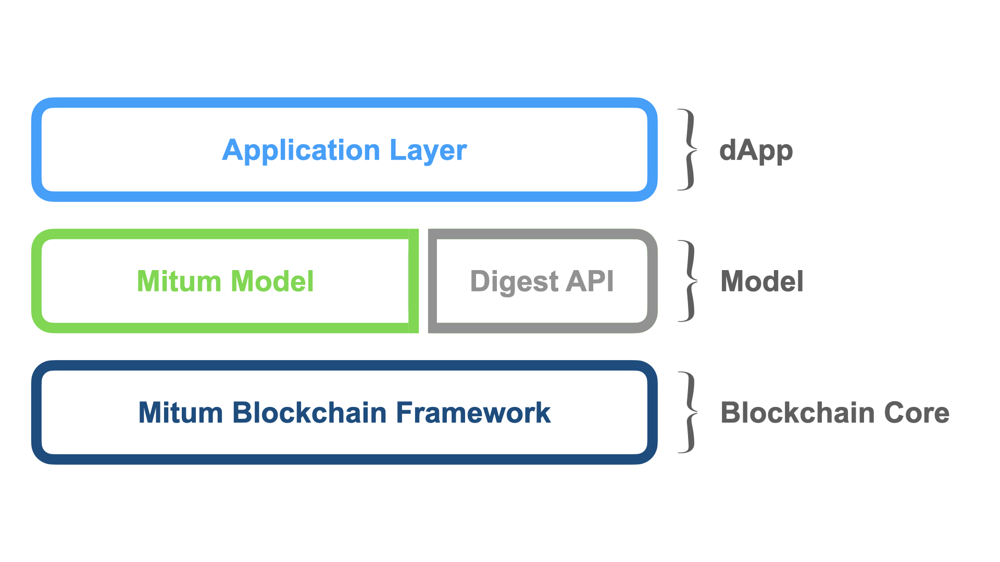

===================================================
Blockchain Application Model
===================================================

| Mitum은 범용 블록체인으로 디자인 되었습니다. 이 요구를 충족하기 위해, Mitum의 정책 및 데이터는 실용적인 방법으로 구성 및 관리할 수 있습니다.

| 간단히 말해, 네트워크 디자이너는 네트워크를 두 부분으로 디자인 할 것입니다.

* 데이터
* 정책

| 데이터와 정책을 디자인함으로써 디자이너는 자신의 네트워크 모델을 구축하고 출시할 수 있습니다.

| 예를 들어, 디자이너가 Mitum에서 currency 모델을 빌드하고자 한다고 가정해봅시다. 그는 여러 currency를 정의할 수 있으며 관련 데이터와 추가적인 정책을 추가할 수 있습니다.

| 데이터 타입:

* 계정
* 잔액

| 정책:

* 총량
* 새 계정의 최소 잔액
* 멀티 시그
* 인플레이션
* 기타...

| 다음 그림은 Mitum 블록체인 코어와 Mitum 모델의 관계를 나타냅니다.

---------------------------------------------------
Digest Service
---------------------------------------------------

* Digest Service는 Mitum에 저장된 블록 데이터를 저장하며 HTTP-based API로 서비스되는 내부 서비스입니다.
* Digest Service에 대한 자세한 내용은 :ref:`rest api` 를 참고해주세요.

---------------------------------------------------
Mitum-based models
---------------------------------------------------

* Mitum 모델은 Mitum 메인 체인을 확장한 확장 레이어로서 다양한 서비스를 제공할 수 있는 솔루션입니다.

* :ref:`currency`
* :ref:`currency extension`
* :ref:`document`
* :ref:`feefi`
* :ref:`nft`