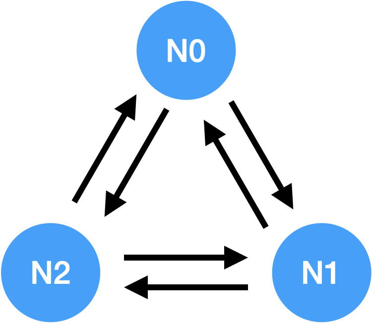
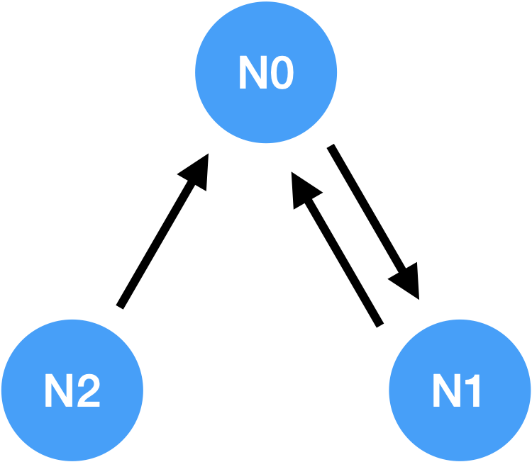
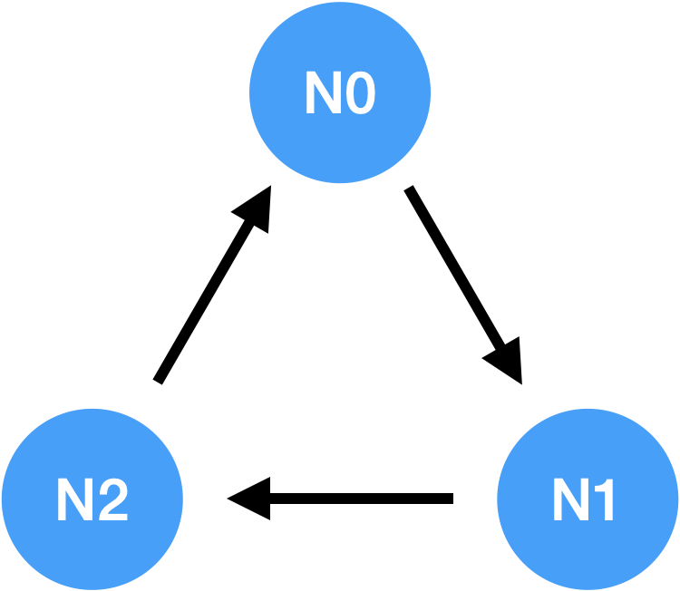
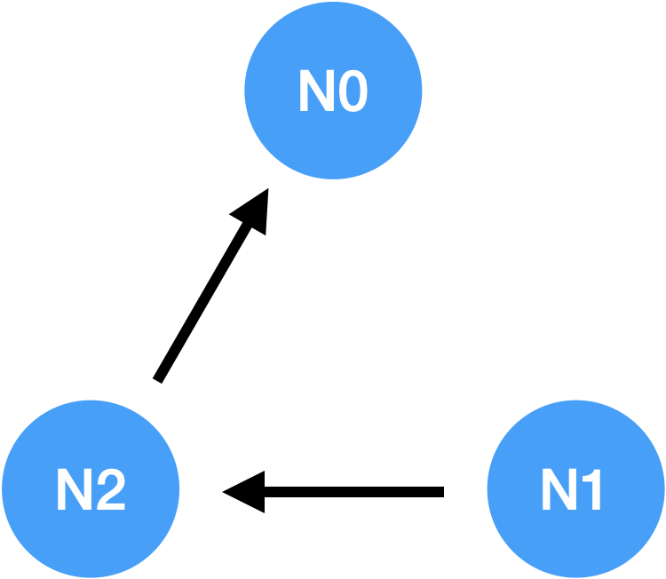
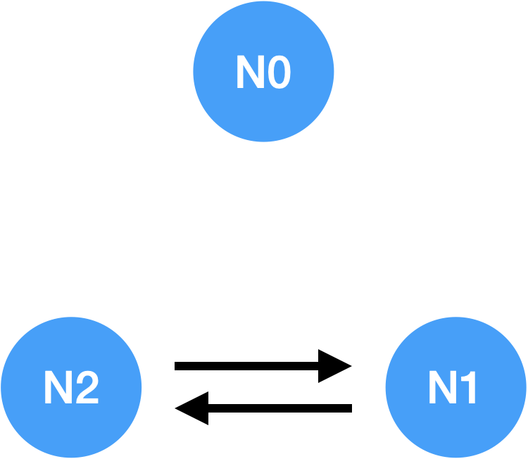

===================================================
Run
===================================================

| Here we will explain the process for running the node.

.. note::

    * A node can find out the addresses of all nodes by using the node discovery protocol.
    * *Digest API* is included in Mitum Currency, so API service is provided by default.
    * Please check `Configuration <https://protocon-general-doc.readthedocs.io/en/latest/docs/run/config.html>`_ for Digest setting.
    * If Digest is not set, data for API service must be processed separately.

---------------------------------------------------
Running the Standalone Node
---------------------------------------------------

| Before running a node, please prepare tutorial.yml by refering to `Configuration <https://protocon-general-doc.readthedocs.io/en/latest/docs/run/config.html>`_.

node init
'''''''''''''''''''''''''''''''''''''''''''''''''''

| First, the *genesis block* and *genesis account* must be created. The main currency is issued through the creation of the *genesis block* and stored in the balance of the *genesis account*.

* tutorial.yml : config file

.. code-block:: shell

    $ ./mc node init --log-level info ./tutorial.yml
    2021-06-10T05:13:09.232802Z INF dryrun? dryrun=false module=command-init
    2021-06-10T05:13:09.235942Z INF prepare to run module=command-init
    2021-06-10T05:13:09.236013Z INF prepared module=command-init
    2021-06-10T05:13:09.780335419Z INF genesis block created block={"hash":"6HjkXEhTNhPzUTG167jsTEany3dHebDQ5cKGNTNEzcgh","height":0} module=command-init
    2021-06-10T05:13:10.786661419Z INF stopped module=command-init
    ...

    $ echo $?
    0

.. note::

    If already saved block data is found, an error ``environment already exists: block=0`` occurs. To reset the error and ignore it, run it by adding the ``--force`` option.    
    
    ``$ ./mc --log-level info init ./tutorial.yml --force``

node run
'''''''''''''''''''''''''''''''''''''''''''''''''''

| When the node is run, the blockchain’s storage status and consensus participation status are changed to *SYNC*, *JOIN*, and *CONSENSUS* modes, and block creation starts.

.. code-block:: shell

    $ ./mc node run --log-level info ./tutorial.yml
    2021-06-10T05:14:08.225487Z INF dryrun? dryrun=false module=command-run
    2021-06-10T05:14:08.228797Z INF prepare to run module=command-run
    2021-06-10T05:14:08.228869Z INF prepared module=command-run
    2021-06-10T05:14:09.706271049Z INF new blocks found to digest last_block=-2 last_manifest=0 module=command-run
    2021-06-10T05:14:09.827980049Z INF digested new blocks module=command-run
    2021-06-10T05:14:09.828967049Z INF trying to start http2 server for digest API bind=https://localhost:54320 module=command-run publish=https://localhost:54320
    2021-06-10T05:14:11.894638049Z INF new block stored block={"hash":"CC57VpSKPozBRABPnznyMk6QY4GHn7CiSH4zSZBs8Rri","height":1,"round":0} elapsed=17.970959 module=basic-consensus-state proposal_hash=DJBgmoAJ4ef7h7iF6E3gTQ83AjWxbGDGQrmDSiQMrfya voteproof_id=BAg2HCNfBenFebuCM4P4HkDfF1off8FCBcSejdK1j7w6
    2021-06-10T05:14:11.907600049Z INF block digested block=1 module=digester

| If the node is a suffrage node, the addresses of other live suffrage nodes can be found using the *Node discovery protocol*. The node discovery feature is only supported when the node is a suffrage node.

* When the suffrage node starts up, it is possible to determine the network information of all suffrage nodes without publish url information of all suffrage nodes.
* For node discovery, a node must set the address of one or more suffrage nodes it knows to a discovery url at startup.

| To specify the discovery url, use the ``–discovery`` command line option.

.. code-block:: shell
    
    $ ./mc node run n0.yml --discovery "https://n1#insecure" --discovery "https://n2#insecure"

* Even if a node does not set the discovery url by itself, if another suffrage node designates this node as a discovery node, the publish url of other nodes is known by the gossip protocol. If the nodes specified by discovery are not running, it keeps trying until it succeeds.
* Again, node discovery only works with suffrage nodes. For nodes not included in the suffrage node list, the urls of other suffrage nodes are still specified in the node settings.
* If you set the log level to info, you can easily check the information of the newly created block.

| ``–log`` command line option can collect logs to the specific files.

| Mitum dumps huge debugging log messages, including *quic* (http) request message like this,

.. code-block:: json
    
    "l":"debug","module":"http2-server","ip":"127.0.0.1","user_agent":"Mozilla/5.0 (Macintosh; Intel Mac OS X 10_15_6) AppleWebKit/605.1.15 (KHTML, like Gecko) Version/14.0.3 Safari/605.1.15","req_id":"c30q3kqciaejf9nj79c0","status":200,"size":2038,"duration":0.541625,"content-length":0,"content-type":"","headers":{"Accept-Language":["en-us"],"Connection":["keep-alive"],"Upgrade-Insecure-Requests":["1"]},"host":"127.0.0.1:54320","method":"GET","proto":"HTTP/1.1","remote":"127.0.0.1:55617","url":"/","t":"2021-06-10T05:23:31.030086621Z","caller":"/Users/soonkukkang/go/pkg/mod/github.com/spikeekips/mitum@v0.0.0-20210609043008-298f37780037/network/http.go:61","m":"request"

| ``–network-log`` command line option can collect these request messages to the specific files.

.. code-block:: shell

    $ ./mc node run \
        --log-level debug \
        --log-format json \
        --log ./mitum.log \
        --network-log ./mitum-request.log \
        ./tutorial.yml

| Multiple file can be set to ``–network-log`` and ``–log``.

| In mitum Currency, ``–network-log`` option will also collect the requests log from *digest API* (http2)
| ``–network-log`` option is only available in ``node run`` command.

Lookup Genesis Account
'''''''''''''''''''''''''''''''''''''''''''''''''''

| You can check *genesis account* information through block files saved in the file system.

| For example,

.. code-block:: shell

    $ find blockfs -name "*-states-*" -print | xargs -n 1 gzcat | grep '^{' | jq '. | select(.key == "9g4BAB8nZdzWmrsAomwdvNJU2hA2psvkfTQ5XdLn4F4r-mca:account") | [ "height: "+(.height|tostring), "state_key: " + .key, "address: " + .value.value.address, .operations, .value.value.keys.keys, .value.value.keys.threshold]'
    [
        "height: 0",
        "state_key: 9g4BAB8nZdzWmrsAomwdvNJU2hA2psvkfTQ5XdLn4F4r-mca:account",
        "address: CoXPgSxcad3fRAbp2JBEeGcYGEQ7dQhdZGWXLbTHpwuGmca",
        [
            "ECSDvWwxcjbEw2F3E6n6pyQXMsZn2uy7msX19XXDCYi8"
        ],
        [
            {
            "_hint": "mitum-currency-key-v0.0.1",
            "weight": 100,
            "key": "rcrd3KA2wWNhKdAP8rHRzfRmgp91oR9mqopckyXRmCvGmpu"
            }
        ],
        100
    ]

.. code-block:: shell

    $ find blockfs -name "*-states-*" -print | xargs -n 1 gzcat | grep '^{' |jq '. | select(.key == "9g4BAB8nZdzWmrsAomwdvNJU2hA2psvkfTQ5XdLn4F4r-mca-MCC:balance") | [ "height: "+(.height|tostring), "state_key: " + .key, "balance:" + .value.value.amount]'
    [
        "height: 0",
        "state_key: 9g4BAB8nZdzWmrsAomwdvNJU2hA2psvkfTQ5XdLn4F4r-mca-MCC:balance",
        "balance:99999999999999999999"
    ]

* *height*, *address* of genesis account at ``0``, ``CoXPgSxcad3fRAbp2JBEeGcYGEQ7dQhdZGWXLbTHpwuGmca`` is saved in block.

Lookup using Digest API
'''''''''''''''''''''''''''''''''''''''''''''''''''

| Account information can also be checked through *Digest API*.

| The api address according to the digest setting `Configuration <https://protocon-general-doc.readthedocs.io/en/latest/docs/run/config.html>`_ is https://localhost:54320.

| Check genesis account through account information.

.. code-block:: shell

    $ curl --insecure http://localhost:54320/account/CoXPgSxcad3fRAbp2JBEeGcYGEQ7dQhdZGWXLbTHpwuGmca | jq '{_embedded}'
    {
        "_embedded": {
            "_hint": "mitum-currency-account-value-v0.0.1",
            "hash": "6vCuuiqaYtNGfPbqfDqA234kiDoueWejd7jMs7dwvq5U",
            "address": "CoXPgSxcad3fRAbp2JBEeGcYGEQ7dQhdZGWXLbTHpwuGmca",
            "keys": {
                "_hint": "mitum-currency-keys-v0.0.1",
                "hash": "9g4BAB8nZdzWmrsAomwdvNJU2hA2psvkfTQ5XdLn4F4r",
                "keys": [
                    {
                    "_hint": "mitum-currency-key-v0.0.1",
                    "weight": 100,
                    "key": "rcrd3KA2wWNhKdAP8rHRzfRmgp91oR9mqopckyXRmCvGmpu"
                    }
                ],
                "threshold": 100
            },
            "balance": [
                {
                    "_hint": "mitum-currency-amount-v0.0.1",
                    "amount": "99999999999999999999",
                    "currency": "MCC"
                }
            ],
            "height": 0,
            "previous_height": -2
        }
    }

---------------------------------------------------
Build Multi Nodes Network
---------------------------------------------------

Order of Execution
'''''''''''''''''''''''''''''''''''''''''''''''''''

1. When executing a multi node, the first node that creates the *genesis block* must be determined. The first node creates the *genesis block* through the ``node init`` command. Nodes other than the one that creates the *genesis block* do not need to execute the ``init`` command.
2. The first node executes the node through the ``run`` command after ``init``.
3. Other nodes also execute each node through the ``run`` command.
4. Other nodes follow the block of the first node through the *sync* process, and the nodes create blocks through the *consensus* process.

| If there are 4 nodes and n0 node is the first node, the execution order is as follows. If all four nodes are suffrage nodes, nodes must set at least one other node *publish url* as the *discovery url* for node discovery.

.. code-block:: shell

    # n0 node
    $ ./mc node init --log-level info ./n0.yml
    $ ./mc node run --log-level info ./n0.yml --discovery "https://n1#insecure"

.. code-block:: shell

    # n1 node
    $ ./mc node run --log-level info ./n1.yml --discovery "https://n0#insecure"

.. code-block:: shell

    # n2 node
    $ ./mc node run --log-level info ./n2.yml --discovery "https://n0#insecure"

.. code-block:: shell

    # n3 node
    $ ./mc node run --log-level info ./n3.yml --discovery "https://n0#insecure"

.. note::

    If running in the same network, nodes should have the same value for the next item in the configuration file.

    * ``genesis-operations``
    * ``network-id``

Four Suffrage Nodes
'''''''''''''''''''''''''''''''''''''''''''''''''''

| Let's suppose we are in case of operating suffrage 4 nodes.

| First, prepare **a separate yml configuration file for each node**.
| ``n0``, ``n1``, ``n2``, ``n3`` are all suffrage nodes.

.. image:: ../images/run.buildnet/4_suffrage_nodes.png
    :height: 570
    :scale: 50 
    :alt: Four Suffrage Nodes

| Depending on the configuration of the node, it is necessary to configure the nodes participating in consensus.

.. code-block:: none

    # Only ``suffrage`` and ``nodes`` part of configuration of suffrage nodes

    suffrage:
        nodes:
            - n0sas
            - n1sas
            - n2sas
            - n3sas

    nodes:
        - address: n0sas
        publickey: skRdC6GGufQ5YLwEipjtdaL2Zsgkxo3YCjp1B6w5V4bDmpu
        tls-insecure: true
        - address: n1sas
        publickey: ktJ4Lb6VcmjrbexhDdJBMnXPXfpGWnNijacdxD2SbvRMmpu
        tls-insecure: true
        - address: n2sas
        publickey: wfVsNvKaGbzB18hwix9L3CEyk5VM8GaogdRT4fD3Z6Zdmpu
        tls-insecure: true
        - address: n3sas
        publickey: vAydAnFCHoYV6VDUhgToWaiVEtn5V4SXEFpSJVcTtRxbmpu
        tls-insecure: true

| The following one is an example of the full yml configuration for all nodes.

.. code-block:: none

    # n0 node

    address: n0sas
    genesis-operations:
        - account-keys:
            keys:
                - publickey: rcrd3KA2wWNhKdAP8rHRzfRmgp91oR9mqopckyXRmCvGmpu
                  weight: 100
            threshold: 100
        currencies:
            - balance: "99999999999999999999"
              currency: MCC
        type: genesis-currencies
    network:
        bind: https://0.0.0.0:54321
        url: https://127.0.0.1:54321
    network-id: mitum
    policy:
        threshold: 100
    privatekey: Kxt22aSeFzJiDQagrvfXPWbEbrTSPsRxbYm9BhNbNJTsrbPbFnPAmpr
    publickey: skRdC6GGufQ5YLwEipjtdaL2Zsgkxo3YCjp1B6w5V4bDmpu
    storage:
        blockdata:
            path: ./n0_data/blockfs
        database:
            uri: mongodb://127.0.0.1:27017/n0_mc
    suffrage:
        nodes:
            - n0sas
            - n1sas
            - n2sas
            - n3sas
    nodes:
        - address: n1sas
          publickey: ktJ4Lb6VcmjrbexhDdJBMnXPXfpGWnNijacdxD2SbvRMmpu
          tls-insecure: true
        - address: n2sas
          publickey: wfVsNvKaGbzB18hwix9L3CEyk5VM8GaogdRT4fD3Z6Zdmpu
          tls-insecure: true
        - address: n3sas
          publickey: vAydAnFCHoYV6VDUhgToWaiVEtn5V4SXEFpSJVcTtRxbmpu
          tls-insecure: true

.. code-block:: none

    # n1 node
    address: n1sas
    genesis-operations:
        - account-keys:
            keys:
                - privatekey: L5GTSKkRs9NPsXwYgACZdodNUJqCAWjz2BccuR4cAgxJumEZWjokmpr
                  publickey: rcrd3KA2wWNhKdAP8rHRzfRmgp91oR9mqopckyXRmCvGmpu
                  weight: 100
            threshold: 100
        currencies:
            - balance: "99999999999999999999"
              currency: MCC
        type: genesis-currencies
    network:
        bind: https://0.0.0.0:54331
        url: https://127.0.0.1:54331
    network-id: mitum
    policy:
        threshold: 100
    privatekey: L4R2AZVmxWUiF2FrNEFi6rHwCTdDLQ1JuQHji69SbMcmWUdNMUSFmpr
    publickey: ktJ4Lb6VcmjrbexhDdJBMnXPXfpGWnNijacdxD2SbvRMmpu
    storage:
        blockdata:
            path: ./n1_data/blockfs
        database:
            uri: mongodb://127.0.0.1:27018/n1_mc
    suffrage:
        nodes:
            - n0sas
            - n1sas
            - n2sas
            - n3sas
    nodes:
        - address: n0sas
          publickey: skRdC6GGufQ5YLwEipjtdaL2Zsgkxo3YCjp1B6w5V4bDmpu
          tls-insecure: true
        - address: n2sas
          publickey: wfVsNvKaGbzB18hwix9L3CEyk5VM8GaogdRT4fD3Z6Zdmpu
          tls-insecure: true
        - address: n3sas
          publickey: vAydAnFCHoYV6VDUhgToWaiVEtn5V4SXEFpSJVcTtRxbmpu
          tls-insecure: true

.. code-block:: none

    # n2 node
    address: n2sas
    genesis-operations:
        - account-keys:
            keys:
                - publickey: rcrd3KA2wWNhKdAP8rHRzfRmgp91oR9mqopckyXRmCvGmpu
                  weight: 100
            threshold: 100
        currencies:
            - balance: "99999999999999999999"
              currency: MCC
        type: genesis-currencies
    network:
        bind: https://0.0.0.0:54332
        url: https://127.0.0.1:54332
    network-id: mitum
    policy:
        threshold: 100
    privatekey: L3Szj4t3w33YLsGFGeaB3v1vwae82yp5KWPcT7v1Y4WyQkAH7eCRmpr
    publickey: wfVsNvKaGbzB18hwix9L3CEyk5VM8GaogdRT4fD3Z6Zdmpu
    storage:
        blockdata:
            path: ./n2_data/blockfs
        database:
            uri: mongodb://127.0.0.1:27019/n2_mc
    suffrage:
        nodes:
            - n0sas
            - n1sas
            - n2sas
            - n3sas
    nodes:
        - address: n0sas
          publickey: skRdC6GGufQ5YLwEipjtdaL2Zsgkxo3YCjp1B6w5V4bDmpu
          tls-insecure: true
        - address: n1sas
          publickey: ktJ4Lb6VcmjrbexhDdJBMnXPXfpGWnNijacdxD2SbvRMmpu
          tls-insecure: true
        - address: n3sas
          publickey: vAydAnFCHoYV6VDUhgToWaiVEtn5V4SXEFpSJVcTtRxbmpu
          tls-insecure: true

.. code-block:: none

    # n3 node
    address: n3sas
    genesis-operations:
        - account-keys:
            keys:
                - publickey: rcrd3KA2wWNhKdAP8rHRzfRmgp91oR9mqopckyXRmCvGmpu
                  weight: 100
            threshold: 100
        currencies:
            - balance: "99999999999999999999"
              currency: MCC
        type: genesis-currencies
    network:
        bind: https://0.0.0.0:54333
        url: https://127.0.0.1:54333
    network-id: mitum
    policy:
        threshold: 100
    privatekey: KwxfBSzwevSggJz2grf8FWrjvXzrctY3WismTy6GNdJpWXe5tF5Lmpr
    publickey: vAydAnFCHoYV6VDUhgToWaiVEtn5V4SXEFpSJVcTtRxbmpu
    storage:
        blockdata:
            path: ./n3_data/blockfs
        database:
            uri: mongodb://127.0.0.1:27020/n3_mc
    suffrage:
        nodes:
            - n0sas
            - n1sas
            - n2sas
            - n3sas
    nodes:
        - address: n0sas
          publickey: skRdC6GGufQ5YLwEipjtdaL2Zsgkxo3YCjp1B6w5V4bDmpu
          tls-insecure: true
        - address: n1sas
          publickey: ktJ4Lb6VcmjrbexhDdJBMnXPXfpGWnNijacdxD2SbvRMmpu
          tls-insecure: true
        - address: n2sas
          publickey: wfVsNvKaGbzB18hwix9L3CEyk5VM8GaogdRT4fD3Z6Zdmpu
          tls-insecure: true

Four Suffrage Nodes and One Sync Node
'''''''''''''''''''''''''''''''''''''''''''''''''''

| In case of operating four suffrage nodes and one sync node(non-suffrage node),

| Prepare a separate yml configuration file for each node.
| ``n0``, ``n1``, ``n2``, ``n3`` are suffrage nodes and ``n4`` is the sync node.

.. image:: ../images/run.buildnet/4_suffrage_nodes_1_sync_node.png
    :height: 570
    :scale: 50 
    :alt: Four Suffrage Nodes

| Only ``suffrage`` and ``nodes`` part of configuration of suffrage nodes(n0, n1, n2, n3) are like,

.. code-block:: none

    suffrage:
        nodes:
            - n0sas
            - n1sas
            - n2sas
            - n3sas

    nodes:
        - address: n0sas
          publickey: skRdC6GGufQ5YLwEipjtdaL2Zsgkxo3YCjp1B6w5V4bDmpu
          tls-insecure: true
        - address: n1sas
          publickey: ktJ4Lb6VcmjrbexhDdJBMnXPXfpGWnNijacdxD2SbvRMmpu
          tls-insecure: true
        - address: n2sas
          publickey: wfVsNvKaGbzB18hwix9L3CEyk5VM8GaogdRT4fD3Z6Zdmpu
          tls-insecure: true
        - address: n3sas
          publickey: vAydAnFCHoYV6VDUhgToWaiVEtn5V4SXEFpSJVcTtRxbmpu
          tls-insecure: true

| Only ``suffrage`` and ``nodes`` part of configuration of sync node(n4) are like,

.. code-block:: none

    # suffrage and nodes part of configuration

    suffrage:
        nodes:
            - n1sas
            - n3sas

    nodes:
        - address: n1sas
          publickey: ktJ4Lb6VcmjrbexhDdJBMnXPXfpGWnNijacdxD2SbvRMmpu
          url: https://127.0.0.1:54331
          tls-insecure: true
        - address: n3sas
          publickey: vAydAnFCHoYV6VDUhgToWaiVEtn5V4SXEFpSJVcTtRxbmpu
          url: https://127.0.0.1:54351
          tls-insecure: true

| The following one is an example of the full yml configuration for all nodes.

.. code-block:: none

    # n0 node(Suffrage node)
    
    address: n0sas
    genesis-operations:
        - account-keys:
            keys:
                - publickey: rcrd3KA2wWNhKdAP8rHRzfRmgp91oR9mqopckyXRmCvGmpu
                  weight: 100
            threshold: 100
        currencies:
            - balance: "99999999999999999999"
              currency: MCC
        type: genesis-currencies
    network:
        bind: https://0.0.0.0:54321
        url: https://127.0.0.1:54321
    network-id: mitum
    policy:
        threshold: 100
    privatekey: Kxt22aSeFzJiDQagrvfXPWbEbrTSPsRxbYm9BhNbNJTsrbPbFnPAmpr
    publickey: skRdC6GGufQ5YLwEipjtdaL2Zsgkxo3YCjp1B6w5V4bDmpu
    storage:
        blockdata:
            path: ./n0_data/blockfs
        database:
            uri: mongodb://127.0.0.1:27017/n0_mc
    suffrage:
        nodes:
            - n0sas
            - n1sas
            - n2sas
            - n3sas
    nodes:
        - address: n1sas
          publickey: ktJ4Lb6VcmjrbexhDdJBMnXPXfpGWnNijacdxD2SbvRMmpu
          tls-insecure: true
        - address: n2sas
          publickey: wfVsNvKaGbzB18hwix9L3CEyk5VM8GaogdRT4fD3Z6Zdmpu
          tls-insecure: true
        - address: n3sas
          publickey: vAydAnFCHoYV6VDUhgToWaiVEtn5V4SXEFpSJVcTtRxbmpu
          tls-insecure: true

.. code-block:: none

    # n1 node(Suffrage node)
    
    address: n1sas
    genesis-operations:
        - account-keys:
            keys:
                - publickey: rcrd3KA2wWNhKdAP8rHRzfRmgp91oR9mqopckyXRmCvGmpu
                  weight: 100
            threshold: 100
        currencies:
            - balance: "99999999999999999999"
              currency: MCC
        type: genesis-currencies
    network:
        bind: https://0.0.0.0:54331
        url: https://127.0.0.1:54331
    network-id: mitum
    policy:
        threshold: 100
    privatekey: L4R2AZVmxWUiF2FrNEFi6rHwCTdDLQ1JuQHji69SbMcmWUdNMUSFmpr
    publickey: ktJ4Lb6VcmjrbexhDdJBMnXPXfpGWnNijacdxD2SbvRMmpu
    storage:
        blockdata:
            path: ./n1_data/blockfs
        database:
            uri: mongodb://127.0.0.1:27018/n1_mc
    suffrage:
        nodes:
            - n0sas
            - n1sas
            - n2sas
            - n3sas
    nodes:
        - address: n0sas
          publickey: skRdC6GGufQ5YLwEipjtdaL2Zsgkxo3YCjp1B6w5V4bDmpu
          tls-insecure: true
        - address: n2sas
          publickey: wfVsNvKaGbzB18hwix9L3CEyk5VM8GaogdRT4fD3Z6Zdmpu
          tls-insecure: true
        - address: n3sas
          publickey: vAydAnFCHoYV6VDUhgToWaiVEtn5V4SXEFpSJVcTtRxbmpu
          tls-insecure: true

.. code-block:: none

    # n2 node(Suffrage node)

    address: n2sas
    genesis-operations:
        - account-keys:
            keys:
                - publickey: rcrd3KA2wWNhKdAP8rHRzfRmgp91oR9mqopckyXRmCvGmpu
                  weight: 100
            threshold: 100
        currencies:
            - balance: "99999999999999999999"
              currency: MCC
        type: genesis-currencies
    network:
        bind: https://0.0.0.0:54332
        url: https://127.0.0.1:54332
    network-id: mitum
    policy:
        threshold: 100
    privatekey: L3Szj4t3w33YLsGFGeaB3v1vwae82yp5KWPcT7v1Y4WyQkAH7eCRmpr
    publickey: wfVsNvKaGbzB18hwix9L3CEyk5VM8GaogdRT4fD3Z6Zdmpu
    storage:
        blockdata:
            path: ./n2_data/blockfs
        database:
            uri: mongodb://127.0.0.1:27019/n2_mc
    suffrage:
        nodes:
            - n0sas
            - n1sas
            - n2sas
            - n3sas
    nodes:
        - address: n0sas
          publickey: skRdC6GGufQ5YLwEipjtdaL2Zsgkxo3YCjp1B6w5V4bDmpu
          tls-insecure: true
        - address: n1sas
          publickey: ktJ4Lb6VcmjrbexhDdJBMnXPXfpGWnNijacdxD2SbvRMmpu
          tls-insecure: true
        - address: n3sas
          publickey: vAydAnFCHoYV6VDUhgToWaiVEtn5V4SXEFpSJVcTtRxbmpu
          tls-insecure: true

.. code-block:: none

    # n3 node(Suffrage node)
    
    address: n3sas
    genesis-operations:
        - account-keys:
            keys:
                - publickey: rcrd3KA2wWNhKdAP8rHRzfRmgp91oR9mqopckyXRmCvGmpu
                  weight: 100
            threshold: 100
        currencies:
            - balance: "99999999999999999999"
              currency: MCC
        type: genesis-currencies
    network:
        bind: https://0.0.0.0:54333
        url: https://127.0.0.1:54333
    network-id: mitum
    policy:
        threshold: 100
    privatekey: KwxfBSzwevSggJz2grf8FWrjvXzrctY3WismTy6GNdJpWXe5tF5Lmpr
    publickey: vAydAnFCHoYV6VDUhgToWaiVEtn5V4SXEFpSJVcTtRxbmpu
    storage:
        blockdata:
            path: ./n3_data/blockfs
        database:
            uri: mongodb://127.0.0.1:27020/n3_mc
    suffrage:
        nodes:
            - n0sas
            - n1sas
            - n2sas
            - n3sas
    nodes:
        - address: n0sas
          publickey: skRdC6GGufQ5YLwEipjtdaL2Zsgkxo3YCjp1B6w5V4bDmpu
          tls-insecure: true
        - address: n1sas
          publickey: ktJ4Lb6VcmjrbexhDdJBMnXPXfpGWnNijacdxD2SbvRMmpu
          tls-insecure: true
        - address: n2sas
          publickey: wfVsNvKaGbzB18hwix9L3CEyk5VM8GaogdRT4fD3Z6Zdmpu
          tls-insecure: true

.. code-block:: none

    # n4 node(Sync node)
    
    address: n4sas
    genesis-operations:
        - account-keys:
            keys:
                - publickey: rcrd3KA2wWNhKdAP8rHRzfRmgp91oR9mqopckyXRmCvGmpu
                  weight: 100
            threshold: 100
        currencies:
            - balance: "99999999999999999999"
              currency: MCC
        type: genesis-currencies
    network:
        bind: https://0.0.0.0:54334
        url: https://127.0.0.1:54334
    network-id: mitum
    policy:
        threshold: 67
    privatekey: KyKM3JtH8M9iBQrcFx4Lubi13Bg8pUPVYvxhihEfkiiqRRWYjjr4mpr
    publickey: 2BQkVjJpMdx4BFEhfTtf1oTaG4nLN148Dfax3ZnWybA2bmpu
    storage:
        blockdata:
            path: ./n4_data/blockfs
        database:
            uri: mongodb://127.0.0.1:27021/n4_mc
    suffrage:
        nodes:
            - n1sas
            - n3sas
    nodes:
        - address: n1sas
          publickey: ktJ4Lb6VcmjrbexhDdJBMnXPXfpGWnNijacdxD2SbvRMmpu
          url: https://127.0.0.1:54331
          tls-insecure: true
        - address: n3sas
          publickey: vAydAnFCHoYV6VDUhgToWaiVEtn5V4SXEFpSJVcTtRxbmpu
          url: https://127.0.0.1:54333
          tls-insecure: true

Node Discovery Scenario
'''''''''''''''''''''''''''''''''''''''''''''''''''

| This is an example of a scenario for *Node Discovery*.

.. code-block:: none

    case 0

    All nodes are looking at each other
    discoveries of n0: n1, n2
    discoveries of n1: n0, n2
    discoveries of n2: n0, n1
    all joined

.. code-block:: none
    
    case 1

    All nodes are looking at the same node and only one node is looking at the other node.
    discoveries of n0: n1
    discoveries of n1: n0
    discoveries of n2: n0
    all joined

.. code-block:: none

    case 2

    All nodes are looking at each other.
    discoveries of n0: n1
    discoveries of n1: n2
    discoveries of n2: n1
    all joined

.. code-block:: none

    case 3

    One node is looking at no one, but another node is looking at it.
    discoveries of n0: none
    discoveries of n1: n2
    discoveries of n2: n0
    all joined

.. code-block:: none

    case 4

    A node sees no one, but no other nodes see it.
    discoveries of n0: none
    discoveries of n1: n2
    discoveries of n2: n1
    n1, n2: connected to each other
    n0: disconnected

