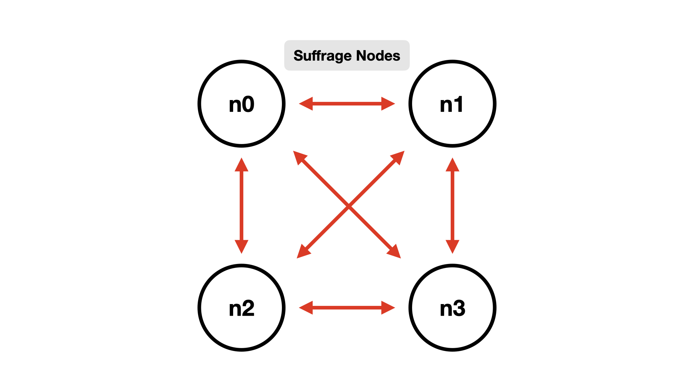
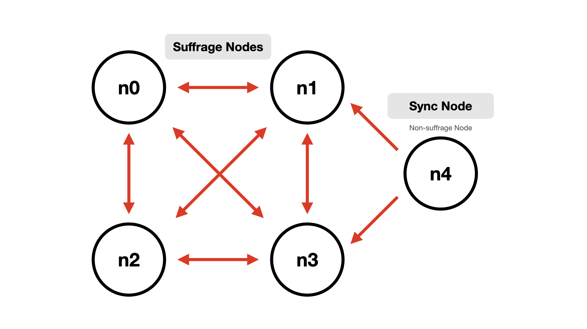
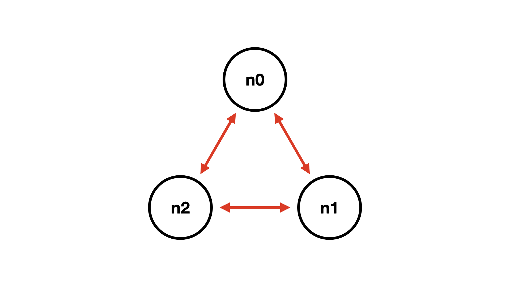
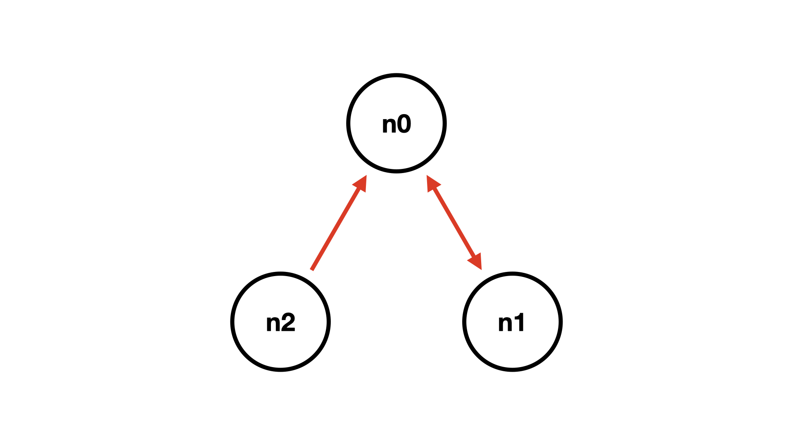
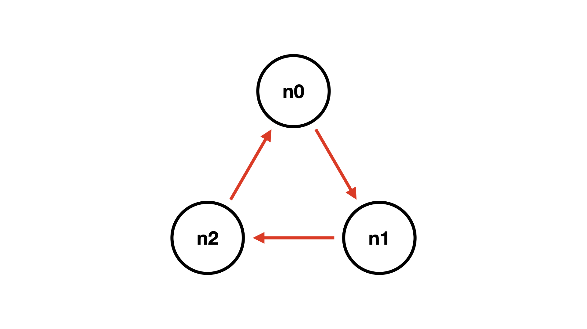
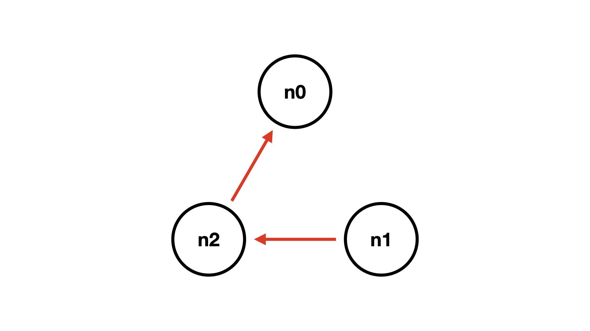
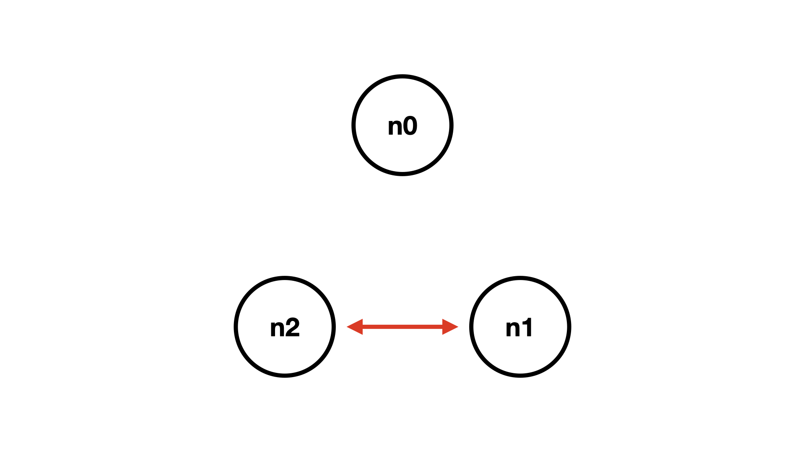

.. _Run:

===================================================
Run
===================================================

| 노드 운용 과정을 설명합니다.

.. note::

    * 노드는 node discovery 프로토콜을 사용해 모든 노드의 주소를 알아낼 수 있습니다.
    * 각 Mitum 모델에는 Digest API가 추가되어 있습니다. 따라서 API 서비스가 기본적으로 제공됩니다.
    * Digest 설정을 위해 :ref:`config` 를 참고하세요.
    * Digest가 설정되지 않으면 API 서비스를 위한 데이터가 별도로 처리됩니다.

---------------------------------------------------
Running the Standalone Node
---------------------------------------------------

| 노드를 운용하기 전에 :ref:`config` 를 참고해 config 파일을 준비해주세요.

.. _node init:

node init
'''''''''''''''''''''''''''''''''''''''''''''''''''

| 우선, genesis block과 genesis account가 생성되어야 합니다. 메인 currency는 genesis block과 함께 발행되며 genesis account의 잔액으로 저장됩니다.

* tutorial.yml : config file

.. code-block:: shell

    $ ./mitum node init --log-level info <config file>
    2021-06-10T05:13:09.232802Z INF dryrun? dryrun=false module=command-init
    2021-06-10T05:13:09.235942Z INF prepare to run module=command-init
    2021-06-10T05:13:09.236013Z INF prepared module=command-init
    2021-06-10T05:13:09.780335419Z INF genesis block created block={"hash":"6HjkXEhTNhPzUTG167jsTEany3dHebDQ5cKGNTNEzcgh","height":0} module=command-init
    2021-06-10T05:13:10.786661419Z INF stopped module=command-init
    ...

.. note::

    만약 이미 저장된 블록이 확인되면 ``environment already exists: block=0`` 에러가 발생합니다. 이 에러를 초기화하고 무시하려면 ``--force`` 옵션과 함께 실행하세요.    
    
    ``$ ./mitum init <config file> --force``

.. _node run:

node run
'''''''''''''''''''''''''''''''''''''''''''''''''''

| 노드가 실행되면 블록체인 스토리지 상태와 합의 참여 상태가 SYNC, JOIN, CONSENSUS 모드로 변경되며 블록 생성이 시작됩니다.

.. code-block:: shell

    $ ./mitum node run --log-level info <config file>
    2021-06-10T05:14:08.225487Z INF dryrun? dryrun=false module=command-run
    2021-06-10T05:14:08.228797Z INF prepare to run module=command-run
    2021-06-10T05:14:08.228869Z INF prepared module=command-run
    2021-06-10T05:14:09.706271049Z INF new blocks found to digest last_block=-2 last_manifest=0 module=command-run
    2021-06-10T05:14:09.827980049Z INF digested new blocks module=command-run
    2021-06-10T05:14:09.828967049Z INF trying to start http2 server for digest API bind=https://localhost:54320 module=command-run publish=https://localhost:54320
    2021-06-10T05:14:11.894638049Z INF new block stored block={"hash":"CC57VpSKPozBRABPnznyMk6QY4GHn7CiSH4zSZBs8Rri","height":1,"round":0} elapsed=17.970959 module=basic-consensus-state proposal_hash=DJBgmoAJ4ef7h7iF6E3gTQ83AjWxbGDGQrmDSiQMrfya voteproof_id=BAg2HCNfBenFebuCM4P4HkDfF1off8FCBcSejdK1j7w6
    2021-06-10T05:14:11.907600049Z INF block digested block=1 module=digester

Lookup Genesis Account
'''''''''''''''''''''''''''''''''''''''''''''''''''

| 파일 시스템에 저장된 블록을 통해 genesis account 정보를 확인할 수 있습니다.

| 다음은 예시입니다.

.. code-block:: shell

    $ find blockfs -name "*-states-*" -print | xargs -n 1 gzcat | grep '^{' | jq '. | select(.key == "9g4BAB8nZdzWmrsAomwdvNJU2hA2psvkfTQ5XdLn4F4r-mca:account") | [ "height: "+(.height|tostring), "state_key: " + .key, "address: " + .value.value.address, .operations, .value.value.keys.keys, .value.value.keys.threshold]'
    [
        "height: 0",
        "state_key: 9g4BAB8nZdzWmrsAomwdvNJU2hA2psvkfTQ5XdLn4F4r-mca:account",
        "address: CoXPgSxcad3fRAbp2JBEeGcYGEQ7dQhdZGWXLbTHpwuGmca",
        [
            "ECSDvWwxcjbEw2F3E6n6pyQXMsZn2uy7msX19XXDCYi8"
        ],
        [
            {
            "_hint": "mitum-currency-key-v0.0.1",
            "weight": 100,
            "key": "rcrd3KA2wWNhKdAP8rHRzfRmgp91oR9mqopckyXRmCvGmpu"
            }
        ],
        100
    ]

.. code-block:: shell

    $ find blockfs -name "*-states-*" -print | xargs -n 1 gzcat | grep '^{' |jq '. | select(.key == "9g4BAB8nZdzWmrsAomwdvNJU2hA2psvkfTQ5XdLn4F4r-mca-MCC:balance") | [ "height: "+(.height|tostring), "state_key: " + .key, "balance:" + .value.value.amount]'
    [
        "height: 0",
        "state_key: 9g4BAB8nZdzWmrsAomwdvNJU2hA2psvkfTQ5XdLn4F4r-mca-MCC:balance",
        "balance:99999999999999999999"
    ]

* height ``0`` 의 genesis account 주소, ``CoXPgSxcad3fRAbp2JBeeGcYGEQ7dQhdZGWXLTHPwuGmca`` 가 블록에 저장됩니다.

Lookup using Digest API
'''''''''''''''''''''''''''''''''''''''''''''''''''

| Digest API를 통해 계정 정보를 확인할 수 있습니다.

| digets 설정 :ref:`config` 에 따른 api 주소는 https://localhost:54320 입니다.

| account 정보를 통해 genesis account를 확인하세요.

.. code-block:: shell

    $ curl --insecure http://localhost:54320/account/CoXPgSxcad3fRAbp2JBEeGcYGEQ7dQhdZGWXLbTHpwuGmca | jq '{_embedded}'
    {
        "_embedded": {
            "_hint": "mitum-currency-account-value-v0.0.1",
            "hash": "6vCuuiqaYtNGfPbqfDqA234kiDoueWejd7jMs7dwvq5U",
            "address": "CoXPgSxcad3fRAbp2JBEeGcYGEQ7dQhdZGWXLbTHpwuGmca",
            "keys": {
                "_hint": "mitum-currency-keys-v0.0.1",
                "hash": "9g4BAB8nZdzWmrsAomwdvNJU2hA2psvkfTQ5XdLn4F4r",
                "keys": [
                    {
                    "_hint": "mitum-currency-key-v0.0.1",
                    "weight": 100,
                    "key": "rcrd3KA2wWNhKdAP8rHRzfRmgp91oR9mqopckyXRmCvGmpu"
                    }
                ],
                "threshold": 100
            },
            "balance": [
                {
                    "_hint": "mitum-currency-amount-v0.0.1",
                    "amount": "99999999999999999999",
                    "currency": "MCC"
                }
            ],
            "height": 0,
            "previous_height": -2
        }
    }

.. _build network:

---------------------------------------------------
Build Multi Nodes Network
---------------------------------------------------

Order of Execution
'''''''''''''''''''''''''''''''''''''''''''''''''''

1. 멀티 노드를 실행할 때 genesis block을 생성하는 첫 노드가 설정되어야 합니다. 첫 노드는 ``node init`` 을 통해 genesis block을 생성합니다. genesis block를 만들지 않는 그 외의 노드들은 ``init`` 을 실행할 필요가 없습니다.
2. 첫 노드는 ``init`` 뒤에 ``run`` 을 실행해 노드를 시작합니다.
3. 다른 노드들도 ``run`` 로 노드를 시작합니다.
4. 다른 노드들은 *sync* 과정을 통해 첫 노드의 블록을 따라가며 노드들은 *consensus* 과정을 통해 블록을 생성합니다.

| 만약 4 개의 노드가 있고 그 중 n0이 첫 노드라면, 실행 순서는 다음과 같습니다. 모든 4 노드가 suffrage 노드일 때 노드들은 node discovery를 위해 최소 하나의 다른 노드의 publish url을 discovery url로 설정해야 합니다.

.. code-block:: shell

    # n0 node
    $ ./mitum node init <n0 config file>
    $ ./mitum node run <n0 config file> --discovery <n1 publish url>

.. code-block:: shell

    # n1 node
    $ ./mitum node run <n1 config file> --discovery <n0 publish url>

.. code-block:: shell

    # n2 node
    $ ./mitum node run <n2 config file> --discovery <n0 publish url>

.. code-block:: shell

    # n3 node
    $ ./mitum node run <n3 config file> --discovery <n0 publish url>

.. note::

    같은 네트워크에서 운용된다면 노드들은 구성 파일의 다음 요소에 대해 같은 값을 가져야 합니다.

    * ``genesis-operations``
    * ``network-id``

Four Suffrage Nodes
'''''''''''''''''''''''''''''''''''''''''''''''''''

| 우리가 네 개의 suffrage 노드들을 운영하려는 상황이라고 가정해봅시다.

| 우선, 각 노드마다 yml config 파일을 준비하세요.
| ``n0``, ``n1``, ``n2``, ``n3`` 가 모두 suffrage 노드입니다.

| 노드에 따라, 합의에 참여하는 노드를 설정해야 합니다.

.. code-block:: none

    # Only ``suffrage`` and ``nodes`` part of configuration of suffrage nodes

    suffrage:
        nodes:
            - n0sas
            - n1sas
            - n2sas
            - n3sas

    nodes:
        - address: n0sas
        publickey: skRdC6GGufQ5YLwEipjtdaL2Zsgkxo3YCjp1B6w5V4bDmpu
        tls-insecure: true
        - address: n1sas
        publickey: ktJ4Lb6VcmjrbexhDdJBMnXPXfpGWnNijacdxD2SbvRMmpu
        tls-insecure: true
        - address: n2sas
        publickey: wfVsNvKaGbzB18hwix9L3CEyk5VM8GaogdRT4fD3Z6Zdmpu
        tls-insecure: true
        - address: n3sas
        publickey: vAydAnFCHoYV6VDUhgToWaiVEtn5V4SXEFpSJVcTtRxbmpu
        tls-insecure: true

| 다음은 모든 노드의 전체 yml 구성의 예제입니다.

.. code-block:: none

    # n0 node

    address: n0sas
    genesis-operations:
        - account-keys:
            keys:
                - publickey: rcrd3KA2wWNhKdAP8rHRzfRmgp91oR9mqopckyXRmCvGmpu
                  weight: 100
            threshold: 100
        currencies:
            - balance: "99999999999999999999"
              currency: MCC
        type: genesis-currencies
    network:
        bind: https://0.0.0.0:54321
        url: https://127.0.0.1:54321
    network-id: mitum
    policy:
        threshold: 100
    privatekey: Kxt22aSeFzJiDQagrvfXPWbEbrTSPsRxbYm9BhNbNJTsrbPbFnPAmpr
    publickey: skRdC6GGufQ5YLwEipjtdaL2Zsgkxo3YCjp1B6w5V4bDmpu
    storage:
        blockdata:
            path: ./n0_data/blockfs
        database:
            uri: mongodb://127.0.0.1:27017/n0_mc
    suffrage:
        nodes:
            - n0sas
            - n1sas
            - n2sas
            - n3sas
    nodes:
        - address: n1sas
          publickey: ktJ4Lb6VcmjrbexhDdJBMnXPXfpGWnNijacdxD2SbvRMmpu
          tls-insecure: true
        - address: n2sas
          publickey: wfVsNvKaGbzB18hwix9L3CEyk5VM8GaogdRT4fD3Z6Zdmpu
          tls-insecure: true
        - address: n3sas
          publickey: vAydAnFCHoYV6VDUhgToWaiVEtn5V4SXEFpSJVcTtRxbmpu
          tls-insecure: true

.. code-block:: none

    # n1 node
    address: n1sas
    genesis-operations:
        - account-keys:
            keys:
                - privatekey: L5GTSKkRs9NPsXwYgACZdodNUJqCAWjz2BccuR4cAgxJumEZWjokmpr
                  publickey: rcrd3KA2wWNhKdAP8rHRzfRmgp91oR9mqopckyXRmCvGmpu
                  weight: 100
            threshold: 100
        currencies:
            - balance: "99999999999999999999"
              currency: MCC
        type: genesis-currencies
    network:
        bind: https://0.0.0.0:54331
        url: https://127.0.0.1:54331
    network-id: mitum
    policy:
        threshold: 100
    privatekey: L4R2AZVmxWUiF2FrNEFi6rHwCTdDLQ1JuQHji69SbMcmWUdNMUSFmpr
    publickey: ktJ4Lb6VcmjrbexhDdJBMnXPXfpGWnNijacdxD2SbvRMmpu
    storage:
        blockdata:
            path: ./n1_data/blockfs
        database:
            uri: mongodb://127.0.0.1:27018/n1_mc
    suffrage:
        nodes:
            - n0sas
            - n1sas
            - n2sas
            - n3sas
    nodes:
        - address: n0sas
          publickey: skRdC6GGufQ5YLwEipjtdaL2Zsgkxo3YCjp1B6w5V4bDmpu
          tls-insecure: true
        - address: n2sas
          publickey: wfVsNvKaGbzB18hwix9L3CEyk5VM8GaogdRT4fD3Z6Zdmpu
          tls-insecure: true
        - address: n3sas
          publickey: vAydAnFCHoYV6VDUhgToWaiVEtn5V4SXEFpSJVcTtRxbmpu
          tls-insecure: true

.. code-block:: none

    # n2 node
    address: n2sas
    genesis-operations:
        - account-keys:
            keys:
                - publickey: rcrd3KA2wWNhKdAP8rHRzfRmgp91oR9mqopckyXRmCvGmpu
                  weight: 100
            threshold: 100
        currencies:
            - balance: "99999999999999999999"
              currency: MCC
        type: genesis-currencies
    network:
        bind: https://0.0.0.0:54332
        url: https://127.0.0.1:54332
    network-id: mitum
    policy:
        threshold: 100
    privatekey: L3Szj4t3w33YLsGFGeaB3v1vwae82yp5KWPcT7v1Y4WyQkAH7eCRmpr
    publickey: wfVsNvKaGbzB18hwix9L3CEyk5VM8GaogdRT4fD3Z6Zdmpu
    storage:
        blockdata:
            path: ./n2_data/blockfs
        database:
            uri: mongodb://127.0.0.1:27019/n2_mc
    suffrage:
        nodes:
            - n0sas
            - n1sas
            - n2sas
            - n3sas
    nodes:
        - address: n0sas
          publickey: skRdC6GGufQ5YLwEipjtdaL2Zsgkxo3YCjp1B6w5V4bDmpu
          tls-insecure: true
        - address: n1sas
          publickey: ktJ4Lb6VcmjrbexhDdJBMnXPXfpGWnNijacdxD2SbvRMmpu
          tls-insecure: true
        - address: n3sas
          publickey: vAydAnFCHoYV6VDUhgToWaiVEtn5V4SXEFpSJVcTtRxbmpu
          tls-insecure: true

.. code-block:: none

    # n3 node
    address: n3sas
    genesis-operations:
        - account-keys:
            keys:
                - publickey: rcrd3KA2wWNhKdAP8rHRzfRmgp91oR9mqopckyXRmCvGmpu
                  weight: 100
            threshold: 100
        currencies:
            - balance: "99999999999999999999"
              currency: MCC
        type: genesis-currencies
    network:
        bind: https://0.0.0.0:54333
        url: https://127.0.0.1:54333
    network-id: mitum
    policy:
        threshold: 100
    privatekey: KwxfBSzwevSggJz2grf8FWrjvXzrctY3WismTy6GNdJpWXe5tF5Lmpr
    publickey: vAydAnFCHoYV6VDUhgToWaiVEtn5V4SXEFpSJVcTtRxbmpu
    storage:
        blockdata:
            path: ./n3_data/blockfs
        database:
            uri: mongodb://127.0.0.1:27020/n3_mc
    suffrage:
        nodes:
            - n0sas
            - n1sas
            - n2sas
            - n3sas
    nodes:
        - address: n0sas
          publickey: skRdC6GGufQ5YLwEipjtdaL2Zsgkxo3YCjp1B6w5V4bDmpu
          tls-insecure: true
        - address: n1sas
          publickey: ktJ4Lb6VcmjrbexhDdJBMnXPXfpGWnNijacdxD2SbvRMmpu
          tls-insecure: true
        - address: n2sas
          publickey: wfVsNvKaGbzB18hwix9L3CEyk5VM8GaogdRT4fD3Z6Zdmpu
          tls-insecure: true

Four Suffrage Nodes and One Sync Node
'''''''''''''''''''''''''''''''''''''''''''''''''''

| 네 개의 suffrage 노드와 하나의 sync 노드(non-suffrage)를 운영하는 경우,

| 각 노드에 대해 yml config 파일을 준비하세요.
| ``n0``, ``n1``, ``n2``, ``n3`` 는 suffrage 노드이며 ``n4`` 가 sync 노드입니다.

| suffrage 노드들(n0, n1, n2, n3) 구성의 ``suffrage`` 와 ``nodes`` 는 다음과 같습니다.

.. code-block:: none

    suffrage:
        nodes:
            - n0sas
            - n1sas
            - n2sas
            - n3sas

    nodes:
        - address: n0sas
          publickey: skRdC6GGufQ5YLwEipjtdaL2Zsgkxo3YCjp1B6w5V4bDmpu
          tls-insecure: true
        - address: n1sas
          publickey: ktJ4Lb6VcmjrbexhDdJBMnXPXfpGWnNijacdxD2SbvRMmpu
          tls-insecure: true
        - address: n2sas
          publickey: wfVsNvKaGbzB18hwix9L3CEyk5VM8GaogdRT4fD3Z6Zdmpu
          tls-insecure: true
        - address: n3sas
          publickey: vAydAnFCHoYV6VDUhgToWaiVEtn5V4SXEFpSJVcTtRxbmpu
          tls-insecure: true

|  sync 노드(n4) 구성의 ``suffrage`` 와 ``nodes`` 은 다음과 같습니다.

.. code-block:: none

    # suffrage and nodes part of configuration

    suffrage:
        nodes:
            - n1sas
            - n3sas
    nodes:
        - address: n1sas
          publickey: ktJ4Lb6VcmjrbexhDdJBMnXPXfpGWnNijacdxD2SbvRMmpu
          url: https://127.0.0.1:54331
          tls-insecure: true
        - address: n3sas
          publickey: vAydAnFCHoYV6VDUhgToWaiVEtn5V4SXEFpSJVcTtRxbmpu
          url: https://127.0.0.1:54351
          tls-insecure: true

| 다음은 모든 노드의 전체 yml의 예제입니다.

.. code-block:: none

    # n0 node(Suffrage node)
    
    address: n0sas
    genesis-operations:
        - account-keys:
            keys:
                - publickey: rcrd3KA2wWNhKdAP8rHRzfRmgp91oR9mqopckyXRmCvGmpu
                  weight: 100
            threshold: 100
        currencies:
            - balance: "99999999999999999999"
              currency: MCC
        type: genesis-currencies
    network:
        bind: https://0.0.0.0:54321
        url: https://127.0.0.1:54321
    network-id: mitum
    policy:
        threshold: 100
    privatekey: Kxt22aSeFzJiDQagrvfXPWbEbrTSPsRxbYm9BhNbNJTsrbPbFnPAmpr
    publickey: skRdC6GGufQ5YLwEipjtdaL2Zsgkxo3YCjp1B6w5V4bDmpu
    storage:
        blockdata:
            path: ./n0_data/blockfs
        database:
            uri: mongodb://127.0.0.1:27017/n0_mc
    suffrage:
        nodes:
            - n0sas
            - n1sas
            - n2sas
            - n3sas
    nodes:
        - address: n1sas
          publickey: ktJ4Lb6VcmjrbexhDdJBMnXPXfpGWnNijacdxD2SbvRMmpu
          tls-insecure: true
        - address: n2sas
          publickey: wfVsNvKaGbzB18hwix9L3CEyk5VM8GaogdRT4fD3Z6Zdmpu
          tls-insecure: true
        - address: n3sas
          publickey: vAydAnFCHoYV6VDUhgToWaiVEtn5V4SXEFpSJVcTtRxbmpu
          tls-insecure: true

.. code-block:: none

    # n1 node(Suffrage node)
    
    address: n1sas
    genesis-operations:
        - account-keys:
            keys:
                - publickey: rcrd3KA2wWNhKdAP8rHRzfRmgp91oR9mqopckyXRmCvGmpu
                  weight: 100
            threshold: 100
        currencies:
            - balance: "99999999999999999999"
              currency: MCC
        type: genesis-currencies
    network:
        bind: https://0.0.0.0:54331
        url: https://127.0.0.1:54331
    network-id: mitum
    policy:
        threshold: 100
    privatekey: L4R2AZVmxWUiF2FrNEFi6rHwCTdDLQ1JuQHji69SbMcmWUdNMUSFmpr
    publickey: ktJ4Lb6VcmjrbexhDdJBMnXPXfpGWnNijacdxD2SbvRMmpu
    storage:
        blockdata:
            path: ./n1_data/blockfs
        database:
            uri: mongodb://127.0.0.1:27018/n1_mc
    suffrage:
        nodes:
            - n0sas
            - n1sas
            - n2sas
            - n3sas
    nodes:
        - address: n0sas
          publickey: skRdC6GGufQ5YLwEipjtdaL2Zsgkxo3YCjp1B6w5V4bDmpu
          tls-insecure: true
        - address: n2sas
          publickey: wfVsNvKaGbzB18hwix9L3CEyk5VM8GaogdRT4fD3Z6Zdmpu
          tls-insecure: true
        - address: n3sas
          publickey: vAydAnFCHoYV6VDUhgToWaiVEtn5V4SXEFpSJVcTtRxbmpu
          tls-insecure: true

.. code-block:: none

    # n2 node(Suffrage node)

    address: n2sas
    genesis-operations:
        - account-keys:
            keys:
                - publickey: rcrd3KA2wWNhKdAP8rHRzfRmgp91oR9mqopckyXRmCvGmpu
                  weight: 100
            threshold: 100
        currencies:
            - balance: "99999999999999999999"
              currency: MCC
        type: genesis-currencies
    network:
        bind: https://0.0.0.0:54332
        url: https://127.0.0.1:54332
    network-id: mitum
    policy:
        threshold: 100
    privatekey: L3Szj4t3w33YLsGFGeaB3v1vwae82yp5KWPcT7v1Y4WyQkAH7eCRmpr
    publickey: wfVsNvKaGbzB18hwix9L3CEyk5VM8GaogdRT4fD3Z6Zdmpu
    storage:
        blockdata:
            path: ./n2_data/blockfs
        database:
            uri: mongodb://127.0.0.1:27019/n2_mc
    suffrage:
        nodes:
            - n0sas
            - n1sas
            - n2sas
            - n3sas
    nodes:
        - address: n0sas
          publickey: skRdC6GGufQ5YLwEipjtdaL2Zsgkxo3YCjp1B6w5V4bDmpu
          tls-insecure: true
        - address: n1sas
          publickey: ktJ4Lb6VcmjrbexhDdJBMnXPXfpGWnNijacdxD2SbvRMmpu
          tls-insecure: true
        - address: n3sas
          publickey: vAydAnFCHoYV6VDUhgToWaiVEtn5V4SXEFpSJVcTtRxbmpu
          tls-insecure: true

.. code-block:: none

    # n3 node(Suffrage node)
    
    address: n3sas
    genesis-operations:
        - account-keys:
            keys:
                - publickey: rcrd3KA2wWNhKdAP8rHRzfRmgp91oR9mqopckyXRmCvGmpu
                  weight: 100
            threshold: 100
        currencies:
            - balance: "99999999999999999999"
              currency: MCC
        type: genesis-currencies
    network:
        bind: https://0.0.0.0:54333
        url: https://127.0.0.1:54333
    network-id: mitum
    policy:
        threshold: 100
    privatekey: KwxfBSzwevSggJz2grf8FWrjvXzrctY3WismTy6GNdJpWXe5tF5Lmpr
    publickey: vAydAnFCHoYV6VDUhgToWaiVEtn5V4SXEFpSJVcTtRxbmpu
    storage:
        blockdata:
            path: ./n3_data/blockfs
        database:
            uri: mongodb://127.0.0.1:27020/n3_mc
    suffrage:
        nodes:
            - n0sas
            - n1sas
            - n2sas
            - n3sas
    nodes:
        - address: n0sas
          publickey: skRdC6GGufQ5YLwEipjtdaL2Zsgkxo3YCjp1B6w5V4bDmpu
          tls-insecure: true
        - address: n1sas
          publickey: ktJ4Lb6VcmjrbexhDdJBMnXPXfpGWnNijacdxD2SbvRMmpu
          tls-insecure: true
        - address: n2sas
          publickey: wfVsNvKaGbzB18hwix9L3CEyk5VM8GaogdRT4fD3Z6Zdmpu
          tls-insecure: true

.. code-block:: none

    # n4 node(Sync node)
    
    address: n4sas
    genesis-operations:
        - account-keys:
            keys:
                - publickey: rcrd3KA2wWNhKdAP8rHRzfRmgp91oR9mqopckyXRmCvGmpu
                  weight: 100
            threshold: 100
        currencies:
            - balance: "99999999999999999999"
              currency: MCC
        type: genesis-currencies
    network:
        bind: https://0.0.0.0:54334
        url: https://127.0.0.1:54334
    network-id: mitum
    policy:
        threshold: 67
    privatekey: KyKM3JtH8M9iBQrcFx4Lubi13Bg8pUPVYvxhihEfkiiqRRWYjjr4mpr
    publickey: 2BQkVjJpMdx4BFEhfTtf1oTaG4nLN148Dfax3ZnWybA2bmpu
    storage:
        blockdata:
            path: ./n4_data/blockfs
        database:
            uri: mongodb://127.0.0.1:27021/n4_mc
    suffrage:
        nodes:
            - n1sas
            - n3sas
    nodes:
        - address: n1sas
          publickey: ktJ4Lb6VcmjrbexhDdJBMnXPXfpGWnNijacdxD2SbvRMmpu
          url: https://127.0.0.1:54331
          tls-insecure: true
        - address: n3sas
          publickey: vAydAnFCHoYV6VDUhgToWaiVEtn5V4SXEFpSJVcTtRxbmpu
          url: https://127.0.0.1:54333
          tls-insecure: true

Node Discovery Scenario
'''''''''''''''''''''''''''''''''''''''''''''''''''

| 다음은 Node Discovery 시나리오의 한 예제입니다.

.. code-block:: none

    case 0

    All nodes are looking at each other
    discoveries of n0: n1, n2
    discoveries of n1: n0, n2
    discoveries of n2: n0, n1
    all joined

.. code-block:: none
    
    case 1

    All nodes are looking at the same node and only one node is looking at the other node.
    discoveries of n0: n1
    discoveries of n1: n0
    discoveries of n2: n0
    all joined

.. code-block:: none

    case 2

    All nodes are looking at each other.
    discoveries of n0: n1
    discoveries of n1: n2
    discoveries of n2: n1
    all joined

.. code-block:: none

    case 3

    One node is looking at no one, but another node is looking at it.
    discoveries of n0: none
    discoveries of n1: n2
    discoveries of n2: n0
    all joined

.. code-block:: none

    case 4

    A node sees no one, but no other nodes see it.
    discoveries of n0: none
    discoveries of n1: n2
    discoveries of n2: n1
    n1, n2: connected to each other
    n0: disconnected

